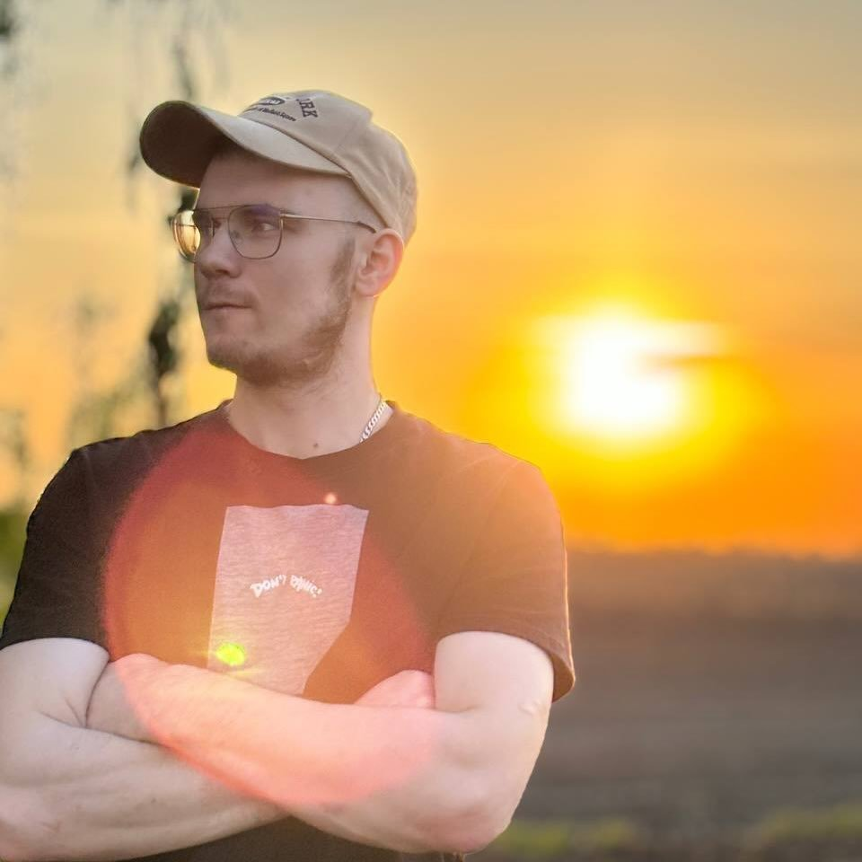

# 
# Dzmitry Vaskou 
! 
# Contacts
*    Location: Leszno, Poland
*    Phone: +48 504 599 023
*    Email: Hobotdmitri@gmail.com
*    Git-Hub: [https://github.com/DzmiVas](DzmiVas)
# About Me
* I have good interpersonal skills, I am very good at working in a team and I am learning something new with great desire and success.
I am a reliable person and you can rely on me in the team, I am always ready to help.
# Skills
* Unfortunately, I don't have any programming language skills, so actually I'm currently taking a course in RSschool. It's my first try, and I think everything going right.
# Code example: 
function sum(a, b) {
  return a + b;
}

`let result = sum(1, 2);
alert( result );`
# Experience 
# Education 
*    University: Belarusian State University Of Food And Chemical Technologies, Mechanical engineer of food processing equipment
# English
A2 (I practice my English by communicating with people from Latin America and other English-speaking countries).